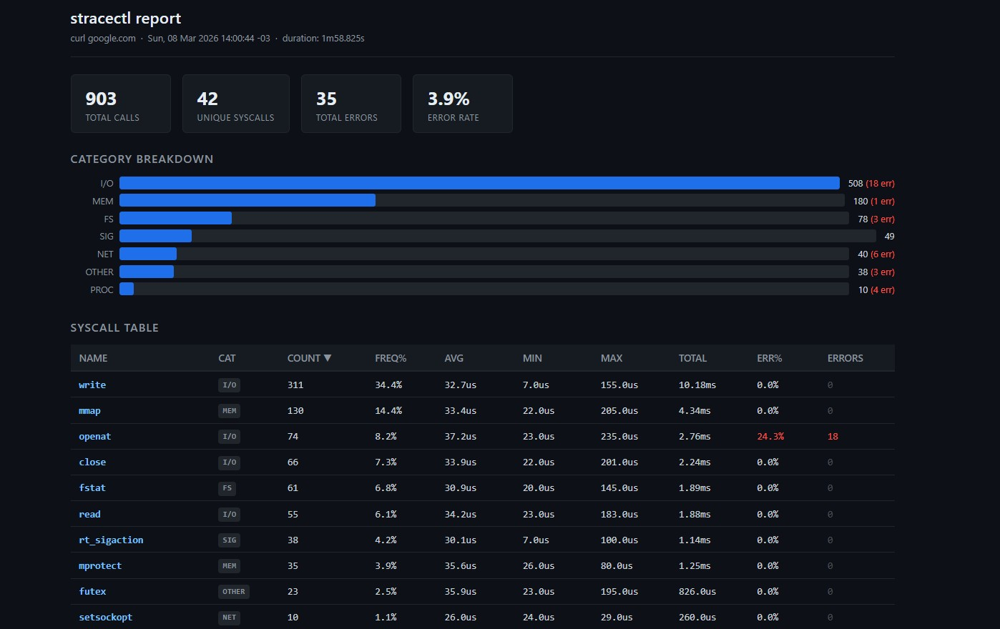
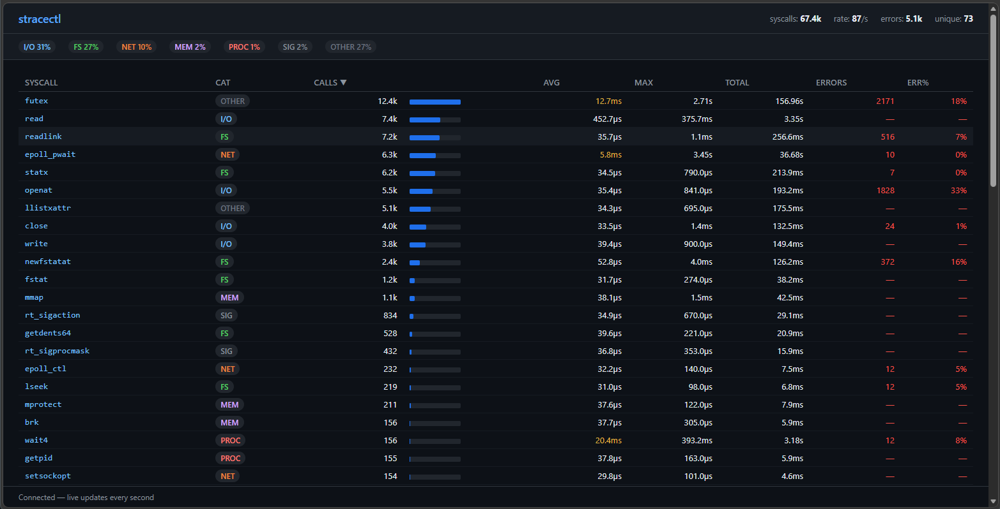
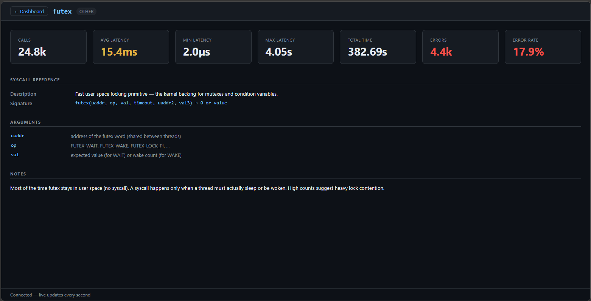
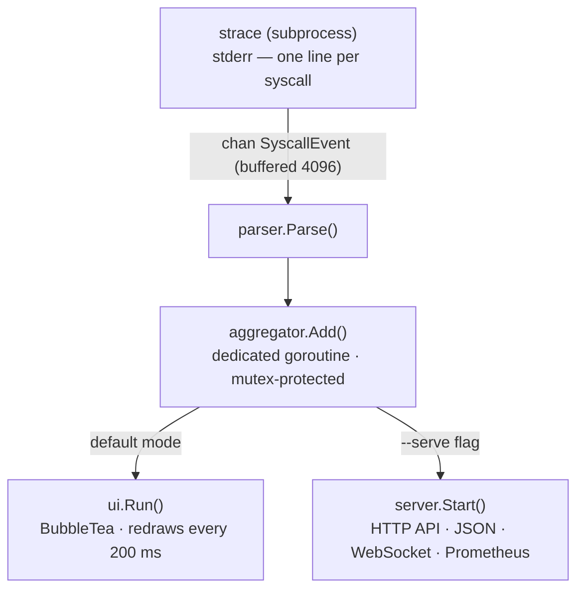

# stracectl

[](https://github.com/fabianoflorentino/stracectl/actions/workflows/ci.yml)
[](https://github.com/fabianoflorentino/stracectl/actions/workflows/docker.yml)
[](https://github.com/fabianoflorentino/stracectl/actions/workflows/linux.yml)
[](https://github.com/fabianoflorentino/stracectl/actions/workflows/trivy.yml)
[](https://github.com/fabianoflorentino/stracectl/releases/latest)

A modern `strace` with a real-time, htop-style TUI — and an HTTP sidecar mode
for Kubernetes troubleshooting.

Instead of scrolling through a wall of syscall output, `stracectl` aggregates
everything live and presents it in an interactive dashboard: per-syscall counts,
latencies, error rates, and category breakdown — all updated while the process runs.

In **sidecar mode** (`--serve`) the TUI is replaced by an HTTP API that exposes
the same data over JSON, WebSocket, and Prometheus endpoints, so you can
troubleshoot a running Pod without attaching a terminal.

```text
 stracectl  /usr/local/bin/homebrew-update  +4s     syscalls: 472  rate: 892/s  errors: 35  unique: 40
──────────────────────────────────────────────────────────────────────────────────
  I/O 35%    FS 28%    NET 18%    MEM 9%    PROC 7%    OTHER 3%
──────────────────────────────────────────────────────────────────────────────────
SYSCALL        CAT    CALLS  FREQ              AVG      MAX      TOTAL  ERRORS  ERR%
──────────────────────────────────────────────────────────────────────────────────
►  openat       I/O     77   ████████░░░░    36.8µs   2.8ms    2.8ms      18   23%
   close        I/O     67   ███████░░░░░    31.9µs   595µs    2.1ms       —    —
   fstat        FS      62   ██████░░░░░░    33.9µs   628µs    2.1ms       —    —
   read         I/O     56   █████░░░░░░░    37.1µs   2.1ms    2.1ms       1    1%
   connect      NET      6   █░░░░░░░░░░░    41.3µs   248µs    248µs       3   50%
──────────────────────────────────────────────────────────────────────────────────
⚠  connect: 50% error rate (3/6 calls) — Happy Eyeballs: IPv4/IPv6 race, loser fails
──────────────────────────────────────────────────────────────────────────────────
 q:quit  c:calls▼  t:total  a:avg  x:max  e:errors  n:name  g:category  /:filter  ↑↓/jk:move  enter/d:details  ?:help
```

Press `d` on any row to open the **detail overlay**:

```text
 stracectl  details: openat  (press any key to close)
──────────────────────────────────────────────────────────────────────────────────
SYSCALL REFERENCE
──────────────────────────────────────────────────────────────────────────────────
  Name              openat
  Category          FS
  Description       Open or create a file, returning a file descriptor.
  Signature         openat(dirfd, pathname, flags, mode) → fd

ARGUMENTS
──────────────────────────────────────────────────────────────────────────────────
  dirfd             AT_FDCWD or directory fd for relative path
  pathname          path to file
  flags             O_RDONLY, O_WRONLY, O_CREAT, O_TRUNC, …
  mode              permission bits when O_CREAT is used

RETURN VALUE
──────────────────────────────────────────────────────────────────────────────────
  On success        new file descriptor (≥ 0)
  On error          -1, errno set
  Common errors     ENOENT (not found), EACCES (permission), EMFILE (too many open fds)

NOTES
──────────────────────────────────────────────────────────────────────────────────
                    High ENOENT error rates are normal: the dynamic linker probes
                    many paths when loading shared libraries.

LIVE STATISTICS
──────────────────────────────────────────────────────────────────────────────────
  Calls             77
  Errors            18  (23%)
  Avg latency       36.8µs
  Max latency       2.8ms
  Min latency       4.1µs
  Total time        2.8ms
──────────────────────────────────────────────────────────────────────────────────
 press any key to return  │  ↑↓/jk to move between syscalls
```

## Features

- **Real-time aggregation** — syscalls counted, timed, and grouped as they happen; no log file needed
- **Merged header bar** — target process, elapsed time, and live stats (syscalls, rate, errors, unique) all in one line
- **Latency columns** — AVG, MAX, and TOTAL time spent in kernel; MAX exposes outliers that averages hide
- **CALLS & ERRORS columns** — raw count and absolute error count alongside ERR% for quick triage
- **Category bar** — instant overview: I/O · FS · NET · MEM · PROC · SIG · OTHER with percentage
- **FREQ sparkbar** — visual proportion of each syscall relative to the most-called one
- **Live rate** — syscalls/second, recalculated every 500 ms
- **Anomaly highlighting** — rows turn yellow when AVG ≥ 5 ms, red when ERR% ≥ 50%, orange when any errors
- **Smart alerts** — panel at the bottom with human-readable explanation of why the error is happening
- **Interactive filter** — press `/` and type to narrow down syscalls in real time
- **Detail overlay** — press `Enter` or `d` on any row to see the syscall's reference (description, signature, args) plus live statistics and anomaly explanation; navigate rows with `↑`/`↓` without leaving the overlay
- **Cursor navigation** — `↑`/`↓` or `j`/`k` to move between rows without leaving the keyboard
- **Help overlay** — press `?` for a full in-app reference of every column, colour, and pattern
- **Multiple sort keys** — count, total time, avg latency, peak latency, errors, name, category
- **Sidecar mode** — `--serve :8080` replaces the TUI with an HTTP API (JSON, WebSocket, Prometheus) and a live HTML dashboard at `/`; also works with `stats`
- **Clickable dashboard rows** — click any syscall row in the web dashboard to navigate to its dedicated detail page
- **Web detail page** — `/syscall/<name>` shows 7 live stat cards (calls, avg/min/max latency, total time, errors, error rate) plus a reference panel (description, C signature, arguments, return values, common errno codes, notes) for ~80 well-known Linux syscalls; unknown syscalls fall back to a `man 2 <name>` hint
- **PID auto-discovery** — `stracectl discover <container-name>` finds the target PID inside a shared-PID-namespace Pod
- **Post-mortem analysis** — `stracectl stats <file>` reads a saved `strace -T -o` log file and displays the same aggregated TUI or HTTP API — no need to re-run the process
- **HTML report export** — `--report <path>` on any trace command (or `stats`) writes a self-contained, sortable HTML file suitable for sharing, archiving, and offline analysis; no external dependencies
- **Kubernetes-ready** — ships with a Dockerfile, raw manifests, and a Helm chart with a hardened sidecar security context

## Requirements

- Linux (uses `ptrace` via the `strace` binary)
- Go 1.21+
- `strace` installed

```bash
# Debian / Ubuntu
sudo apt install strace

# Fedora / RHEL
sudo dnf install strace
```

## Install

```bash
git clone https://github.com/fabianoflorentino/stracectl
cd stracectl
go build -o stracectl .
sudo mv stracectl /usr/local/bin/
```

Or use the pre-built container image:

```bash
docker pull ghcr.io/fabianoflorentino/stracectl:latest
```

## Usage

### Trace a command from the start

```bash
sudo stracectl run curl https://example.com
sudo stracectl run -- python3 app.py --port 8080
```

Add `--report` to save a self-contained HTML file when the session ends:

```bash
sudo stracectl run --report report.html curl https://example.com
```

### Attach to a running process

```bash
sudo stracectl attach 1234
sudo stracectl attach "$(pgrep nginx | head -1)"
```

Save a report on exit:

```bash
sudo stracectl attach --report nginx-report.html 1234
```

### Analyse a saved strace file (post-mortem)

If you already have a strace log captured with `-T`, you can analyse it offline:

```bash
# Capture with strace
strace -T -o trace.log curl https://example.com

# Analyse in TUI (no process needed)
stracectl stats trace.log

# Analyse and expose the same HTTP API
stracectl stats --serve :8080 trace.log

# Analyse and write an HTML report
stracectl stats --report report.html trace.log
```

### REPORT

[](docs/img/report.jpg)

The report is a self-contained HTML file — no server, no CDN, no `stracectl` installation
needed. It includes a summary bar, category breakdown, and a fully sortable syscall table
that can be shared, archived, or attached to an incident report.

### Sidecar / HTTP API mode

Pass `--serve <addr>` to any command to replace the TUI with an HTTP server:

```bash
# trace a command and expose results over HTTP
sudo stracectl run --serve :8080 curl https://example.com

# attach to PID 42 and stream metrics to Prometheus
sudo stracectl attach --serve :8080 42
```

Opening `http://localhost:8080` in any browser shows the **live web dashboard** — a
self-contained single-page app that connects to the server over WebSocket and updates
the table in real time, with no page reload needed:

---

### DASHBOARD

[](docs/img/dashboard.png)

### DETAIL

[](docs/img/detail.png)

---

**Dashboard features:**

- All columns are **clickable to sort** (ascending / descending toggle, with `▲`/`▼` indicator)
- Category pills use the same colour coding as the TUI (blue = I/O, green = FS, orange = NET, purple = MEM, red = PROC)
- Syscall names shown in blue; error counts and ERR% highlighted in red; slow AVG in yellow (≥ 5 ms)
- The spark bar scales relative to the most-called syscall in the current snapshot
- Auto-reconnects if the server restarts or the connection drops
- Status bar at the bottom shows connection state

Available endpoints:

| Endpoint | Description |
| ---------- | ------------- |
| `GET /` | Live HTML dashboard with WebSocket-powered table and category pills |
| `GET /syscall/{name}` | Per-syscall detail page: 7 live stat cards + full reference panel |
| `GET /healthz` | Liveness probe — always returns `ok` |
| `GET /api/stats` | JSON snapshot of all syscall stats, sorted by count |
| `GET /api/categories` | JSON breakdown by category |
| `GET /api/syscall/{name}` | JSON stats for a single syscall by name (404 if not yet seen) |
| `WS /stream` | WebSocket push — fresh snapshot every second |
| `GET /metrics` | Prometheus exposition format |

### Per-syscall detail page

Click any row in the web dashboard to open a dedicated detail page at
`/syscall/<name>` (e.g. `/syscall/openat`). The page has two sections:

**Live stat cards** (updated via the WebSocket stream every second):

| Card | Description |
| ---- | ----------- |
| Calls | Total number of times this syscall was called |
| Avg Latency | Mean kernel time per call (yellow when ≥ 5 ms) |
| Min Latency | Lowest observed kernel time |
| Max Latency | Peak observed kernel time |
| Total Time | Cumulative kernel time across all calls |
| Errors | Absolute count of failed calls (red) |
| Error Rate | Percentage of calls that returned an error (red) |

**Syscall reference panel** (static, rendered immediately from an embedded table):

| Section | Contents |
| ------- | -------- |
| **SYSCALL REFERENCE** | plain-English description, C signature (blue monospace) |
| **ARGUMENTS** | each parameter name and what it controls |
| **RETURN VALUE** | on-success value, `-1, errno set`, common errno codes (amber) |
| **NOTES** | real-world patterns, caveats, and diagnostic tips |

The embedded knowledge base covers ~80 common Linux syscalls. Unknown syscalls
receive a generic entry with a `man 2 <name>` hint.

A **← Dashboard** button in the header returns to the main view.

### Discover a container PID (Kubernetes sidecar)

When `shareProcessNamespace: true` is set on a Pod, all container processes
are visible from the sidecar. Use `discover` to find the right PID:

```bash
stracectl discover myapp
# prints the lowest PID whose cgroup path matches "myapp"
```

Then attach:

```bash
stracectl attach --serve :8080 "$(stracectl discover myapp)"
```

> **Permissions:** `strace` requires `CAP_SYS_PTRACE`.
> Run with `sudo`, or set `/proc/sys/kernel/yama/ptrace_scope` to `0` for your user.

## Keyboard shortcuts

| Key | Action |
| ----- | -------- |
| `↑` / `k` | move cursor up |
| `↓` / `j` | move cursor down |
| `Enter` / `d` / `D` | open detail overlay for selected row |
| `c` | sort by CALLS (default) |
| `t` | sort by TOTAL time |
| `a` | sort by AVG latency |
| `x` | sort by MAX latency |
| `e` | sort by error count |
| `n` | sort alphabetically |
| `g` | sort by category |
| `/` | open filter prompt |
| `esc` | clear filter / reset cursor |
| `?` | open help overlay |
| `q` / `Ctrl+C` | quit |

## Reading the dashboard

### Header bar

```text
 stracectl  /usr/local/bin/homebrew-update  +1m22s     syscalls: 139.0k  rate: 16096/s  errors: 23.3k  unique: 90
```

The single top bar combines the target process identity with live counters:

- **target** — path or command being traced
- **elapsed** — wall-clock time since tracing started
- **syscalls** — total calls captured
- **rate** — current syscalls/second; a sudden spike or drop is the first sign of anomaly
- **errors** — absolute count of failed calls
- **unique** — number of distinct syscall names; a low value on a busy process often means a tight loop

### Category bar

```text
  I/O 35%    FS 28%    NET 18%    MEM 9%    PROC 7%    OTHER 3%
```

Tells you at a glance what the process is doing.
A server idling should show mostly NET.
A process at 80%+ FS is scanning directories or checking many files.

| Category | Syscalls included |
| -------- | ---------------- |
| I/O | `read`, `write`, `openat`, `close`, `pread64`, … |
| FS | `stat`, `fstat`, `access`, `lseek`, `getdents64`, … |
| NET | `socket`, `connect`, `sendto`, `recvfrom`, `epoll_wait`, … |
| MEM | `mmap`, `munmap`, `mprotect`, `madvise`, `brk`, … |
| PROC | `clone`, `execve`, `wait4`, `prctl`, `getpid`, … |
| SIG | `rt_sigaction`, `rt_sigprocmask`, `eventfd`, … |
| OTHER | everything not in the above categories |

### Table columns

| Column | Description |
| ------ | ----------- |
| `SYSCALL` | syscall name |
| `CAT` | category (I/O, FS, NET, MEM, PROC, SIG, OTHER) |
| `CALLS` | total number of times this syscall was called |
| `FREQ` | bar showing count relative to the most-called syscall |
| `AVG` | average kernel time per call (yellow when ≥ 5 ms) |
| `MAX` | peak latency — outliers that avg hides |
| `TOTAL` | cumulative kernel time |
| `ERRORS` | absolute number of failed calls (red when > 0) |
| `ERR%` | percentage of calls that returned an error (red when > 0) |

### Row colours

| Colour | Meaning |
| -------- | ------- |
| White/gray | normal |
| **Yellow** | AVG latency ≥ 5 ms — kernel spending significant time here |
| Orange | some errors, ERR% < 50% — often harmless |
| **Red bold** | ERR% ≥ 50% — more than half of all calls are failing |

### Anomaly alerts

When a row crosses a threshold, an alerts panel with explanations appears **below the syscall rows**, between the bottom divider and the footer:

```text
──────────────────────────────────────────────────────────────────────────────
⚠  ioctl: 100% error rate (3/3 calls) — terminal control failed (no TTY)
⚠  connect: 45% error rate — Happy Eyeballs: IPv4/IPv6 tried in parallel, loser fails
⚡  wait4: slow avg 8.2ms (max 34ms) — kernel spending time in this call
──────────────────────────────────────────────────────────────────────────────
 q:quit  c:calls▼  …
```

### Common patterns explained

| What you see | Why it happens | Is it a problem? |
| --- | --- | --- |
| `openat` high ERR% | dynamic linker searches many paths before finding the `.so` | No |
| `recvfrom` high ERR% | `EAGAIN` on a non-blocking socket — no data ready yet | No |
| `connect` ~50% ERR% | Happy Eyeballs: IPv4 and IPv6 raced, loser is discarded | No |
| `ioctl` 100% ERR% | process has no TTY (running piped or under `sudo`) | No |
| `madvise` ERR% | kernel rejected memory hint — informational | No |
| `access` 100% ERR% | optional config file does not exist | Rarely |
| any syscall yellow | slow kernel path — I/O wait, lock contention, or disk | Investigate |
| any syscall red | repeated real failures | Yes |

### Detail overlay

Press `Enter` or `d` (or `D`) on any highlighted row to open a full-screen panel for that syscall.
Navigate rows with `↑`/`↓` or `j`/`k` without leaving the overlay. Press any other key to close it.

The overlay is divided into sections:

| Section | Contents |
| ------- | -------- |
| **SYSCALL REFERENCE** | name, category, plain-English description, C signature |
| **ARGUMENTS** | each parameter name and what it controls |
| **RETURN VALUE** | on-success value, common `errno` codes |
| **NOTES** | real-world patterns, caveats, and tips |
| **LIVE STATISTICS** | calls, errors, avg / max / min latency, total kernel time |
| **ANOMALY EXPLANATION** | appears when `ERR% ≥ 50 %`; explains why the error is expected or alarming |

The knowledge base covers ~80 common Linux syscalls. Unknown syscalls receive a generic entry pointing to `man 2 <name>`.

### Help overlay

Press `?` at any time to open a full in-app reference covering every column,
colour, category, common pattern, and keyboard shortcut. Press any key to return.

## Deploying as a Kubernetes sidecar

### Prerequisites

- Kubernetes 1.19+
- `strace` available in the sidecar image (included in the published image)
- `shareProcessNamespace: true` on the Pod spec

> **Security note:** `CAP_SYS_PTRACE` is a powerful capability. Only use this
> in debug/staging namespaces, or protect it with `PodSecurityAdmission`.

### Quick start with raw manifests

```bash
# 1. Edit the target PID in deploy/k8s/sidecar-pod.yaml
#    (or use `stracectl discover <container-name>` at runtime)
kubectl apply -f deploy/k8s/sidecar-pod.yaml

# 2. Forward the port
kubectl port-forward pod/myapp-stracectl 8080

# 3. Query
curl http://localhost:8080/api/stats | jq .
curl http://localhost:8080/metrics
# wscat -c ws://localhost:8080/stream
```

### Helm chart

The Helm chart provides a `stracectl.sidecar` template you can include in
your existing Deployment:

```bash
# Install the chart (creates a ServiceMonitor if serviceMonitor.enabled=true)
helm install stracectl ./deploy/helm/stracectl \
  --set targetPID=1 \
  --set targetContainer=myapp \
  --set serviceMonitor.enabled=true
```

In your Deployment template, add the sidecar container:

```yaml
spec:
  shareProcessNamespace: true
  template:
    spec:
      containers:
        - name: myapp
          image: myapp:latest
        {{- include "stracectl.sidecar" . | nindent 8 }}
```

### Prometheus metrics

When running in sidecar mode, `/metrics` exposes:

| Metric | Type | Description |
| -------- | ------ | ------------- |
| `stracectl_syscall_calls_total` | Counter | Total invocations per syscall/category |
| `stracectl_syscall_errors_total` | Counter | Failed invocations per syscall/category |
| `stracectl_syscall_duration_seconds_total` | Counter | Cumulative kernel time per syscall |
| `stracectl_syscall_duration_avg_seconds` | Gauge | Average kernel time per syscall |
| `stracectl_syscall_duration_max_seconds` | Gauge | Peak kernel time per syscall |
| `stracectl_syscalls_per_second` | Gauge | Recent call rate |

## Project structure

```text
stracectl/
├── main.go
├── Dockerfile
├── cmd/
│   ├── root.go              # Cobra root command
│   ├── attach.go            # stracectl attach [--serve] [--report] <pid>
│   ├── run.go               # stracectl run [--serve] [--report] <cmd>
│   ├── stats.go             # stracectl stats [--serve] [--report] <file>
│   └── discover.go          # stracectl discover <container-name>
├── deploy/
│   ├── k8s/
│   │   ├── sidecar-pod.yaml # example Pod with hardened sidecar securityContext
│   │   └── servicemonitor.yaml
│   └── helm/stracectl/      # Helm chart
└── internal/
    ├── models/
    │   └── event.go         # SyscallEvent struct
    ├── parser/
    │   └── parser.go        # parses strace output lines → SyscallEvent
    ├── aggregator/
    │   └── aggregator.go    # thread-safe stats, categories, sorting
    ├── tracer/
    │   └── strace.go        # spawns strace subprocess, emits events on a channel
    ├── discover/
    │   └── discover.go      # PID discovery via /proc/<pid>/cgroup
    ├── report/
    │   ├── report.go        # HTML report renderer (html/template + go:embed)
    │   └── static/
    │       └── report.html  # embedded report template
    ├── server/
    │   └── server.go        # HTTP API (JSON + WebSocket + Prometheus)
    └── ui/
        ├── tui.go           # BubbleTea full-screen TUI
        └── syscall_help.go  # syscall descriptions and errno explanations
```

### Architecture



## Known Limitations

| Limitation | Impact |
| --- | --- |
| **`strace` binary dependency** — not eBPF; shells out to the system `strace` at runtime | Must be installed on the host (`apt install strace`) or use the container image |
| **`<unfinished ...>` lines not merged** — when `-f` (follow threads) splits a syscall across two output lines, the args from the first half are lost | Call counts and latency are unaffected; only `Args` for those calls is incomplete |
| **Hardcoded PID `"1"` in the sidecar manifest** — `deploy/k8s/sidecar-pod.yaml` uses `"1"` as a placeholder | Replace it at deploy time or use `stracectl discover <container-name>` inside the sidecar to get the real PID before attaching |
| **Sidecar must run as root** — `ptrace` is a kernel-level capability; `runAsNonRoot: false` is required | Limit exposure by deploying only in debug/staging namespaces and protecting the Pod with `PodSecurityAdmission` |
| **WebSocket `/stream` has no authentication** — `CheckOrigin` accepts any origin unconditionally | Safe for in-cluster / port-forward usage; do not expose the port externally without an auth proxy or network policy |
| **`MinTime` not in `/api/stats`** — the aggregator tracks minimum syscall latency but the bulk stats endpoint does not expose it | The value is visible in the TUI detail overlay (`d` key) and in the web detail page (`/syscall/{name}`) |

See [docs/ROADMAP.md](docs/ROADMAP.md) for the implementation plan addressing each of these items.

## Running the tests

```bash
# all packages
go test ./internal/...

# with race detector (recommended)
go test ./internal/... -race

# verbose output
go test ./internal/... -v
```

## Dependencies

| Package | Purpose |
| -------- | ------- |
| [charmbracelet/bubbletea](https://github.com/charmbracelet/bubbletea) | TUI framework |
| [charmbracelet/lipgloss](https://github.com/charmbracelet/lipgloss) | terminal styling |
| [spf13/cobra](https://github.com/spf13/cobra) | CLI commands |
| [prometheus/client_golang](https://github.com/prometheus/client_golang) | Prometheus metrics |
| [gorilla/websocket](https://github.com/gorilla/websocket) | WebSocket stream |

## License

Apache 2.0
