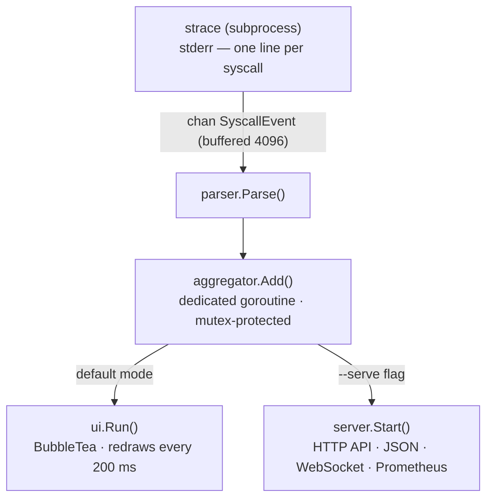

# stracectl

[](https://github.com/fabianoflorentino/stracectl/actions/workflows/ci.yml)
[](https://github.com/fabianoflorentino/stracectl/actions/workflows/docker.yml)
[](https://github.com/fabianoflorentino/stracectl/actions/workflows/dependabot/update-graph)
[](https://github.com/fabianoflorentino/stracectl/actions/workflows/github-code-scanning/codeql)
[](https://github.com/fabianoflorentino/stracectl/actions/workflows/trivy.yml)
[](https://github.com/fabianoflorentino/stracectl/actions/workflows/dependabot/dependabot-updates)
[](https://github.com/fabianoflorentino/stracectl/releases/latest)

A modern `strace` with a real-time, htop-style TUI — and an HTTP sidecar mode
for Kubernetes troubleshooting.

Instead of scrolling through a wall of syscall output, `stracectl` aggregates
everything live and presents it in an interactive dashboard: per-syscall counts,
latencies, error rates, and category breakdown — all updated while the process runs.

In **sidecar mode** (`--serve`) the TUI is replaced by an HTTP API that exposes
the same data over JSON, WebSocket, and Prometheus endpoints, so you can
troubleshoot a running Pod without attaching a terminal.

```text
 stracectl  /usr/local/bin/homebrew-update  +4s     syscalls: 472  rate: 892/s  errors: 35  unique: 40
──────────────────────────────────────────────────────────────────────────────────
  I/O 35%    FS 28%    NET 18%    MEM 9%    PROC 7%    OTHER 3%
──────────────────────────────────────────────────────────────────────────────────
SYSCALL        CAT    CALLS  FREQ              AVG      MAX      TOTAL  ERRORS  ERR%
──────────────────────────────────────────────────────────────────────────────────
►  openat       I/O     77   ████████░░░░    36.8µs   2.8ms    2.8ms      18   23%
   close        I/O     67   ███████░░░░░    31.9µs   595µs    2.1ms       —    —
   fstat        FS      62   ██████░░░░░░    33.9µs   628µs    2.1ms       —    —
   read         I/O     56   █████░░░░░░░    37.1µs   2.1ms    2.1ms       1    1%
   connect      NET      6   █░░░░░░░░░░░    41.3µs   248µs    248µs       3   50%
──────────────────────────────────────────────────────────────────────────────────
⚠  connect: 50% error rate (3/6 calls) — Happy Eyeballs: IPv4/IPv6 race, loser fails
──────────────────────────────────────────────────────────────────────────────────
 q:quit  c:calls▼  t:total  a:avg  x:max  e:errors  n:name  g:category  /:filter  ↑↓/jk:move  enter/d:details  ?:help
```

Press `enter/d` on any row to open the **detail overlay**:

```text
 stracectl  details: openat  (press any key to close)
──────────────────────────────────────────────────────────────────────────────────
SYSCALL REFERENCE
──────────────────────────────────────────────────────────────────────────────────
  Name              openat
  Category          FS
  Description       Open or create a file, returning a file descriptor.
  Signature         openat(dirfd, pathname, flags, mode) → fd

ARGUMENTS
──────────────────────────────────────────────────────────────────────────────────
  dirfd             AT_FDCWD or directory fd for relative path
  pathname          path to file
  flags             O_RDONLY, O_WRONLY, O_CREAT, O_TRUNC, …
  mode              permission bits when O_CREAT is used

RETURN VALUE
──────────────────────────────────────────────────────────────────────────────────
  On success        new file descriptor (≥ 0)
  On error          -1, errno set
  Common errors     ENOENT (not found), EACCES (permission), EMFILE (too many open fds)

NOTES
──────────────────────────────────────────────────────────────────────────────────
                    High ENOENT error rates are normal: the dynamic linker probes
                    many paths when loading shared libraries.

LIVE STATISTICS
──────────────────────────────────────────────────────────────────────────────────
  Calls             77
  Errors            18  (23%)
  Avg latency       36.8µs
  Max latency       2.8ms
  Min latency       4.1µs
  Total time        2.8ms
──────────────────────────────────────────────────────────────────────────────────
 press any key to return  │  ↑↓/jk to move between syscalls
```

## Features

- **Real-time aggregation** — syscalls counted, timed, and grouped as they happen; no log file needed
- **Latency columns** — AVG, MAX, TOTAL, P95, and P99 per syscall; MAX exposes outliers that averages always hide
- **Per-errno breakdown** — track how many failures map to `ENOENT`, `EACCES`, `EAGAIN`, … and a 50-entry ring buffer of recent error samples
- **Smart anomaly alerts** — rows turn red/yellow on threshold; human-readable explanations at the bottom of the TUI and web dashboard
- **Detail overlay** — press `Enter` on any row to see the syscall's signature, arguments, errno codes, and live stats inline — no browser tab needed
- **Built-in syscall reference** — ~50 canonical syscalls with C signatures, argument descriptions, common errors, and diagnostic notes
- **Sidecar mode** — `--serve :8080` replaces the TUI with JSON, WebSocket, and Prometheus endpoints plus a live HTML dashboard
- **Post-mortem analysis** — replay any `strace -T -o` log through the same TUI or HTTP API without a live process
- **HTML report export** — `--report report.html` writes a self-contained, sortable HTML file with no external dependencies
- **Kubernetes-ready** — Dockerfile, raw manifests, and Helm chart with a hardened sidecar security context

## Requirements

- Linux (uses `ptrace` via the `strace` binary)
- Go 1.26+
- `strace` installed

```bash
# Debian / Ubuntu
sudo apt install strace

# Fedora / RHEL
sudo dnf install strace
```

## Install

```bash
git clone https://github.com/fabianoflorentino/stracectl
cd stracectl
go build -o stracectl .
sudo mv stracectl /usr/local/bin/
```

Or use the pre-built container image:

```bash
docker pull fabianoflorentino/stracectl:<version>
```

## Quick Start

```bash
# Trace a new command
sudo stracectl run curl https://example.com

# Attach to a running process
sudo stracectl attach 1234

# Post-mortem: analyse a saved strace log
stracectl stats trace.log

# HTTP sidecar mode (JSON + WebSocket + Prometheus at :8080)
sudo stracectl run --serve :8080 curl https://example.com

# Write a self-contained HTML report on exit
sudo stracectl run --report report.html curl https://example.com
```

> Full usage guide — all commands, HTTP API endpoints, keyboard shortcuts, dashboard reading guide, and common patterns: **[docs/USAGE.md](docs/USAGE.md)**

## Documentation

| Document | Description |
| -------- | ----------- |
| [docs/USAGE.md](docs/USAGE.md) | Commands, keyboard shortcuts, dashboard guide, HTTP API, common patterns |
| [docs/KUBERNETES.md](docs/KUBERNETES.md) | Sidecar deployment, Helm chart, Prometheus metrics |
| [site/content/docs/syscalls.md](site/content/docs/syscalls.md) | Built-in syscall reference (signatures, arguments, errno codes) |
| [docs/CHANGELOG.md](docs/CHANGELOG.md) | Release history |
| [docs/ROADMAP.md](docs/ROADMAP.md) | Planned improvements |

## Syscall Reference

stracectl ships a built-in reference for ~50 canonical Linux syscalls (covering ~80 names via aliases).
The detail overlay (`Enter`/`d`) and the web detail page (`/syscall/<name>`) surface this information inline.

| Name | Category | Aliases | Description |
| ---- | -------- | ------- | ----------- |
| `read` | I/O | — | Read bytes from a file descriptor |
| `write` | I/O | — | Write bytes to a file descriptor |
| `openat` | I/O | `open` | Open or create a file |
| `close` | I/O | — | Close a file descriptor |
| `pipe` | I/O | `pipe2` | Create an anonymous pipe |
| `dup` | I/O | `dup2`, `dup3` | Duplicate a file descriptor |
| `sendfile` | I/O | `copy_file_range` | Zero-copy transfer between two fds |
| `fcntl` | FS | — | Miscellaneous fd operations (flags, locks) |
| `fstat` | FS | `stat`, `lstat`, `newfstatat`, `statx` | File metadata (size, permissions, inode) |
| `getdents64` | FS | `getdents` | Read directory entries |
| `access` | FS | `faccessat`, `faccessat2` | Check file access permissions |
| `lseek` | FS | `llseek` | Reposition read/write offset |
| `statfs` | FS | `fstatfs` | Filesystem statistics (free space, type) |
| `socket` | NET | — | Create a socket |
| `bind` | NET | — | Assign local address to socket |
| `listen` | NET | — | Mark socket as passive |
| `connect` | NET | — | Initiate a connection |
| `accept4` | NET | `accept` | Accept incoming connection |
| `recvfrom` | NET | `recv`, `recvmsg`, `recvmmsg` | Receive data from socket |
| `sendto` | NET | `send`, `sendmsg`, `sendmmsg` | Send data through socket |
| `setsockopt` | NET | `getsockopt` | Socket options |
| `getsockname` | NET | `getpeername` | Get socket local/remote address |
| `epoll_wait` | NET | `epoll_pwait` | Wait for I/O events |
| `epoll_ctl` | NET | — | Manage epoll fd set |
| `poll` | NET | `ppoll` | Wait for events on fds |
| `mmap` | MEM | `mmap2` | Map memory or files |
| `munmap` | MEM | — | Remove memory mapping |
| `mprotect` | MEM | — | Change memory protection |
| `madvise` | MEM | — | Memory usage hints to kernel |
| `brk` | MEM | — | Adjust heap boundary |
| `clone` | PROC | `clone3` | Create process or thread |
| `execve` | PROC | `execveat` | Execute a program |
| `exit_group` | PROC | `exit` | Terminate all threads in process |
| `wait4` | PROC | `waitpid`, `waitid` | Wait for child state change |
| `getpid` | PROC | — | Get process ID |
| `getuid` | PROC | `geteuid`, `getgid`, `getegid` | Get user/group ID |
| `prctl` | PROC | — | Control process attributes |
| `prlimit64` | PROC | — | Get/set resource limits |
| `set_tid_address` | PROC | — | Set thread exit cleanup address |
| `arch_prctl` | PROC | — | Architecture-specific thread state (TLS) |
| `rt_sigaction` | SIG | `sigaction` | Install signal handler |
| `rt_sigprocmask` | SIG | `sigprocmask` | Block or unblock signals |
| `eventfd` | SIG | `eventfd2` | Event notification file descriptor |
| `futex` | OTHER | — | Fast user-space mutex / condvar |
| `ioctl` | OTHER | — | Device-specific control operations |
| `getrandom` | OTHER | — | Cryptographic random bytes from kernel |

For full details — signatures, argument descriptions, return values, common errno codes, and diagnostic notes — see [site/content/docs/syscalls.md](site/content/docs/syscalls.md).

## Project structure

```text
stracectl/
├── main.go
├── Dockerfile
├── cmd/
│   ├── root.go              # Cobra root command
│   ├── attach.go            # stracectl attach [--serve] [--report] <pid>
│   ├── run.go               # stracectl run [--serve] [--report] <cmd>
│   ├── stats.go             # stracectl stats [--serve] [--report] <file>
│   └── discover.go          # stracectl discover <container-name>
├── deploy/
│   ├── k8s/
│   │   ├── sidecar-pod.yaml # example Pod with hardened sidecar securityContext
│   │   └── servicemonitor.yaml
│   └── helm/stracectl/      # Helm chart
└── internal/
    ├── models/
    │   └── event.go         # SyscallEvent struct
    ├── parser/
    │   └── parser.go        # parses strace output lines → SyscallEvent
    ├── aggregator/
    │   └── aggregator.go    # thread-safe stats, categories, sorting
    ├── tracer/
    │   └── strace.go        # spawns strace subprocess, emits events on a channel
    ├── discover/
    │   └── discover.go      # PID discovery via /proc/<pid>/cgroup
    ├── report/
    │   ├── report.go        # HTML report renderer (html/template + go:embed)
    │   └── static/
    │       └── report.html  # embedded report template
    ├── server/
    │   └── server.go        # HTTP API (JSON + WebSocket + Prometheus)
    └── ui/
        ├── tui.go           # BubbleTea full-screen TUI
        └── syscall_help.go  # syscall descriptions and errno explanations
```

### Architecture




## Autenticação por token no WebSocket (`/stream`)

> Novo em vX.Y.Z — Autenticação opcional para o endpoint WebSocket `/stream`.

Para evitar acessos não autorizados ao endpoint WebSocket (por exemplo, quando a porta está exposta fora do cluster), você pode exigir um token compartilhado:

### Ativação rápida

- Inicie o servidor com a flag `--ws-token <token>` (qualquer comando com `--serve`):

```bash
./stracectl --serve --ws-token "SUPER_SECRET_TOKEN"
```

- Ou passe o token por variável de ambiente no shell e expanda no comando:

```bash
WS_TOKEN=SUPER_SECRET_TOKEN ./stracectl --serve --ws-token "$WS_TOKEN"
```

- Se `--ws-token` não for definido, o endpoint permanece aberto (comportamento padrão).

### Exemplos de cliente

Prefira enviar o token em um header `Authorization: Bearer <token>` quando o cliente suportar headers. Exemplos práticos:

- Usando `wscat` (header):

```bash
wscat -c ws://localhost:8080/stream -H "Authorization: Bearer SUPER_SECRET_TOKEN"
```

- Usando `wscat` (query string):

```bash
wscat -c ws://localhost:8080/stream?token=SUPER_SECRET_TOKEN
```

- Node.js (`ws`):

```js
const WebSocket = require('ws');
const ws = new WebSocket('ws://localhost:8080/stream', {
  headers: { Authorization: 'Bearer SUPER_SECRET_TOKEN' }
});
ws.on('open', () => console.log('connected'));
```

- Browser (observação importante):

```js
// Browsers não permitem headers customizados no construtor WebSocket.
// Use query string ou um proxy que injete o header Authorization.
const ws = new WebSocket('wss://example.com/stream?token=SUPER_SECRET_TOKEN');
ws.onopen = () => console.log('connected');
```

### Kubernetes / containers (exemplo)

Crie um Secret e injete como variável de ambiente no Pod. Em seguida, expanda a variável no comando de inicialização:

```bash
kubectl create secret generic stracectl-ws-token --from-literal=ws-token=SUPER_SECRET_TOKEN
```

Exemplo de fragmento no `Deployment` (expande a variável no `command`):

```yaml
env:
  - name: WS_TOKEN
    valueFrom:
      secretKeyRef:
        name: stracectl-ws-token
        key: ws-token
command: ["/bin/sh", "-c", "exec /usr/local/bin/stracectl --serve --ws-token \"$WS_TOKEN\""]
```

### Notas de segurança

- Prefira enviar o token no header `Authorization: Bearer` quando possível.
- Tokens na query string podem vazar em logs, referers ou histórico; se usar query string, sempre combine com TLS (`wss://`).
- O token **não é gerado automaticamente** — gerencie, rote e rode o token de forma segura e considere rotação/expiração.
- O dashboard web padrão não solicita token; proteja o dashboard com um proxy reverso autenticado ou melhore a UI para suportar login/token.

Para testar, use `wscat` / `websocat` ou a biblioteca `ws` no Node.

---

## Known Limitations

| Limitation | Impact |
| --- | --- |
| **`strace` binary dependency** — not eBPF; shells out to the system `strace` at runtime | Must be installed on the host (`apt install strace`) or use the container image |
| **Hardcoded PID `"1"` in the sidecar manifest** — `deploy/k8s/sidecar-pod.yaml` uses `--container app` | Replace it at deploy time to match the real application container name |
| **Sidecar must run as root** — `ptrace` is a kernel-level capability; `runAsNonRoot: false` is required | Limit exposure by deploying only in debug/staging namespaces and protecting the Pod with `PodSecurityAdmission` |
| **WebSocket `/stream` token authentication is optional** — If `--ws-token` is not set, the endpoint is open. | Always set a strong token if exposing the port externally. |
| **`MinTime` not in `/api/stats`** — the aggregator tracks minimum syscall latency but the bulk stats endpoint does not expose it | The value is visible in the TUI detail overlay (`d` key) and in the web detail page (`/syscall/{name}`) |

See [docs/ROADMAP.md](docs/ROADMAP.md) for the implementation plan addressing each of these items.

## Running the tests

```bash
# all packages
go test ./internal/...

# with race detector (recommended)
go test ./internal/... -race

# verbose output
go test ./internal/... -v
```

## Dependencies

| Package | Purpose |
| -------- | ------- |
| [charmbracelet/bubbletea](https://github.com/charmbracelet/bubbletea) | TUI framework |
| [charmbracelet/lipgloss](https://github.com/charmbracelet/lipgloss) | terminal styling |
| [spf13/cobra](https://github.com/spf13/cobra) | CLI commands |
| [prometheus/client_golang](https://github.com/prometheus/client_golang) | Prometheus metrics |
| [gorilla/websocket](https://github.com/gorilla/websocket) | WebSocket stream |

## License

Apache 2.0
