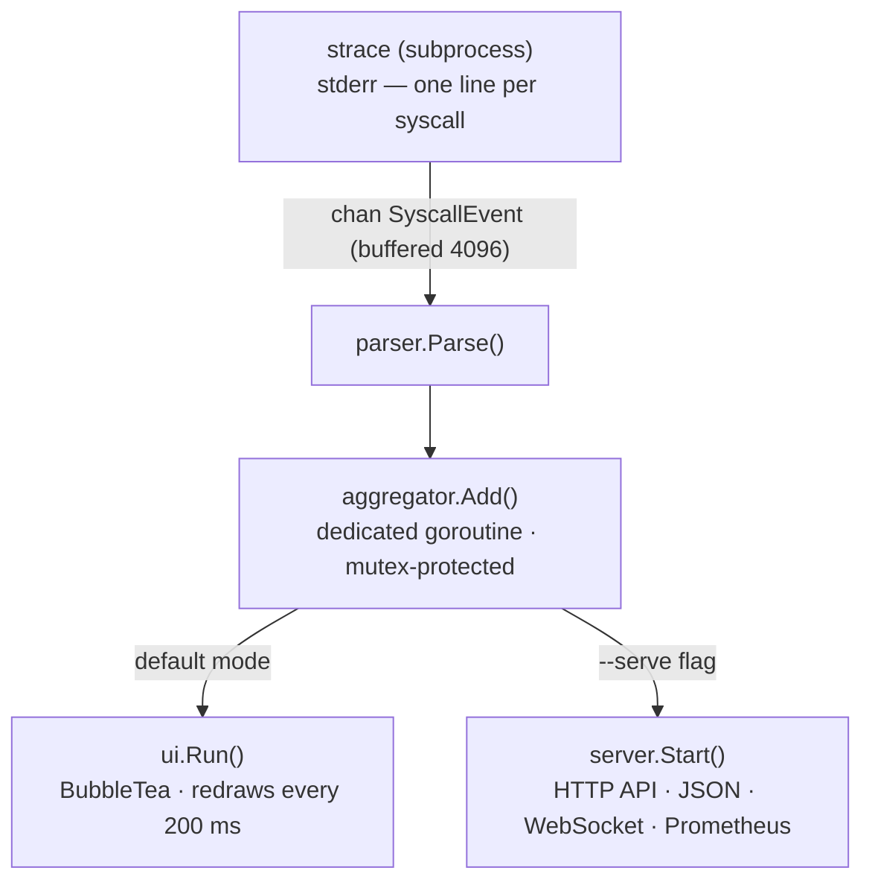

# stracectl

[](https://github.com/fabianoflorentino/stracectl/actions/workflows/ci.yml)

A modern `strace` with a real-time, htop-style TUI — and an HTTP sidecar mode
for Kubernetes troubleshooting.

Instead of scrolling through a wall of syscall output, `stracectl` aggregates
everything live and presents it in an interactive dashboard: per-syscall counts,
latencies, error rates, and category breakdown — all updated while the process runs.

In **sidecar mode** (`--serve`) the TUI is replaced by an HTTP API that exposes
the same data over JSON, WebSocket, and Prometheus endpoints, so you can
troubleshoot a running Pod without attaching a terminal.

```text
 stracectl  curl google.com                   elapsed: 4s
  syscalls: 472    rate:  892/s   unique: 40   errors: 35 (7.4%)
  I/O:35%  │  FS:28%  │  NET:18%  │  MEM:9%  │  PROC:7%  │  OTHER:3%
  Process is mainly reading and writing data (60%) — ✓ 7% errors (likely normal)
──────────────────────────────────────────────────────────────────────────────────
SYSCALL        CAT      REQ  FREQ              AVG      MAX      TOTAL    ERR%
──────────────────────────────────────────────────────────────────────────────────
⚠ connect: 45% error rate (5/11 calls) — Happy Eyeballs: IPv4/IPv6 race, loser fails
──────────────────────────────────────────────────────────────────────────────────
openat         I/O       77  ████████░░░░    36.8µs   2.8ms    2.8ms     23%
close          I/O       67  ███████░░░░░    31.9µs   595µs    2.1ms      —
fstat          FS        62  ██████░░░░░░    33.9µs   628µs    2.1ms      —
read           I/O       56  █████░░░░░░░    37.1µs   2.1ms    2.1ms      —
connect        NET        6  █░░░░░░░░░░░    41.3µs   248µs    248µs     50%
──────────────────────────────────────────────────────────────────────────────────
 q:quit  c:count▼  t:total  a:avg  x:max  e:errors  n:name  /:filter  ?:help
```

## Features

- **Real-time aggregation** — syscalls counted, timed, and grouped as they happen; no log file needed
- **Latency columns** — AVG, MAX, and TOTAL time spent in kernel; MAX exposes outliers that averages hide
- **ERR%** — error rate per syscall; `access` at 100% (2/2) is more alarming than `openat` at 23% (18/77)
- **Category bar** — instant overview: I/O · FS · NET · MEM · PROC · SIG · OTHER
- **Summary line** — plain-English sentence describing what the process is doing and its health
- **FREQ sparkbar** — visual proportion of each syscall relative to the most-called one
- **Live rate** — syscalls/second, recalculated every 500 ms
- **Anomaly highlighting** — rows turn yellow when AVG ≥ 5 ms, red when ERR% ≥ 50%
- **Smart alerts** — banner with human-readable explanation of why the error is happening
- **Interactive filter** — press `/` and type to narrow down syscalls in real time
- **Help overlay** — press `?` for a full in-app reference of every column, colour, and pattern
- **Multiple sort keys** — count, total time, avg latency, peak latency, errors, name
- **Sidecar mode** — `--serve :8080` replaces the TUI with an HTTP API (JSON, WebSocket, Prometheus)
- **PID auto-discovery** — `stracectl discover <container-name>` finds the target PID inside a shared-PID-namespace Pod
- **Kubernetes-ready** — ships with a Dockerfile, raw manifests, and a Helm chart

## Requirements

- Linux (uses `ptrace` via the `strace` binary)
- Go 1.21+
- `strace` installed

```bash
# Debian / Ubuntu
sudo apt install strace

# Fedora / RHEL
sudo dnf install strace
```

## Install

```bash
git clone https://github.com/fabianoflorentino/stracectl
cd stracectl
go build -o stracectl .
sudo mv stracectl /usr/local/bin/
```

Or use the pre-built container image:

```bash
docker pull ghcr.io/fabianoflorentino/stracectl:latest
```

## Usage

### Trace a command from the start

```bash
sudo stracectl run curl https://example.com
sudo stracectl run -- python3 app.py --port 8080
```

### Attach to a running process

```bash
sudo stracectl attach 1234
sudo stracectl attach "$(pgrep nginx | head -1)"
```

### Sidecar / HTTP API mode

Pass `--serve <addr>` to any command to replace the TUI with an HTTP server:

```bash
# trace a command and expose results over HTTP
sudo stracectl run --serve :8080 curl https://example.com

# attach to PID 42 and stream metrics to Prometheus
sudo stracectl attach --serve :8080 42
```

Available endpoints:

| Endpoint | Description |
| ---------- | ------------- |
| `GET /healthz` | Liveness probe — always returns `ok` |
| `GET /api/stats` | JSON snapshot of all syscall stats, sorted by count |
| `GET /api/categories` | JSON breakdown by category |
| `WS /stream` | WebSocket push — fresh snapshot every second |
| `GET /metrics` | Prometheus exposition format |

### Discover a container PID (Kubernetes sidecar)

When `shareProcessNamespace: true` is set on a Pod, all container processes
are visible from the sidecar. Use `discover` to find the right PID:

```bash
stracectl discover myapp
# prints the lowest PID whose cgroup path matches "myapp"
```

Then attach:

```bash
stracectl attach --serve :8080 "$(stracectl discover myapp)"
```

> **Permissions:** `strace` requires `CAP_SYS_PTRACE`.
> Run with `sudo`, or set `/proc/sys/kernel/yama/ptrace_scope` to `0` for your user.

## Keyboard shortcuts

| Key | Action |
| ----- | -------- |
| `c` | sort by COUNT (default) |
| `t` | sort by TOTAL time |
| `a` | sort by AVG latency |
| `x` | sort by MAX latency |
| `e` | sort by error count |
| `n` | sort alphabetically |
| `/` | open filter prompt |
| `esc` | clear filter |
| `?` | open help overlay |
| `q` / `Ctrl+C` | quit |

## Reading the dashboard

### Stats bar

```text
syscalls: 472    rate: 892/s   unique: 40   errors: 35 (7.4%)
```

- **syscalls** — total calls captured since tracing started
- **rate** — current syscalls/second; a sudden spike or drop is the first sign of anomaly
- **unique** — number of distinct syscall names; low value on a busy process often means a tight loop
- **errors** — absolute count and percentage of failed calls

### Category bar

```text
I/O:35%  │  FS:28%  │  NET:18%  │  MEM:9%  │  PROC:7%  │  OTHER:3%
```

Tells you at a glance what the process is doing.
A server idling should show mostly NET.
A process at 80%+ FS is scanning directories or checking many files.

| Category | Syscalls included |
| -------- | ---------------- |
| I/O | `read`, `write`, `openat`, `close`, `pread64`, … |
| FS | `stat`, `fstat`, `access`, `lseek`, `getdents64`, … |
| NET | `socket`, `connect`, `sendto`, `recvfrom`, `epoll_wait`, … |
| MEM | `mmap`, `munmap`, `mprotect`, `madvise`, `brk`, … |
| PROC | `clone`, `execve`, `wait4`, `prctl`, `getpid`, … |
| SIG | `rt_sigaction`, `rt_sigprocmask`, `eventfd`, … |
| OTHER | everything not in the above categories |

### Summary line

```text
Process is mainly reading and writing data (60%), then networking (11%) — ✓ 7% errors (likely normal)
```

A plain-English sentence that combines the dominant category with a health indicator:

| Indicator | Meaning |
| --------- | ------- |
| `✓ no errors` | all syscalls succeeded |
| `✓ X% (likely normal)` | errors below 15% — usually harmless (linker searches, EAGAIN) |
| `⚠ X% (worth investigating)` | errors between 15–40% |
| `✗ X% (high, check alerts)` | errors above 40% |

### Row colours

| Colour | Meaning |
| -------- | ------- |
| White | normal |
| **Yellow** | AVG latency ≥ 5 ms — kernel spending significant time here |
| Orange | some errors, ERR% < 50% — often harmless |
| **Red bold** | ERR% ≥ 50% — more than half of all calls are failing |

### Anomaly alerts

When a row crosses a threshold, a banner with an explanation appears above the data:

```text
⚠  ioctl: 100% error rate (3/3 calls) — terminal control failed (no TTY)
⚠  connect: 45% error rate — Happy Eyeballs: IPv4/IPv6 tried in parallel, loser fails
⚡  openat: slow avg 8.2ms (max 34ms) — kernel spending time in this call
```

### Common patterns explained

| What you see | Why it happens | Is it a problem? |
| --- | --- | --- |
| `openat` high ERR% | dynamic linker searches many paths before finding the `.so` | No |
| `recvfrom` high ERR% | `EAGAIN` on a non-blocking socket — no data ready yet | No |
| `connect` ~50% ERR% | Happy Eyeballs: IPv4 and IPv6 raced, loser is discarded | No |
| `ioctl` 100% ERR% | process has no TTY (running piped or under `sudo`) | No |
| `madvise` ERR% | kernel rejected memory hint — informational | No |
| `access` 100% ERR% | optional config file does not exist | Rarely |
| any syscall yellow | slow kernel path — I/O wait, lock contention, or disk | Investigate |
| any syscall red | repeated real failures | Yes |

### Help overlay

Press `?` at any time to open a full in-app reference covering every column,
colour, category, common pattern, and keyboard shortcut. Press any key to return.

## Deploying as a Kubernetes sidecar

### Prerequisites

- Kubernetes 1.19+
- `strace` available in the sidecar image (included in the published image)
- `shareProcessNamespace: true` on the Pod spec

> **Security note:** `CAP_SYS_PTRACE` is a powerful capability. Only use this
> in debug/staging namespaces, or protect it with `PodSecurityAdmission`.

### Quick start with raw manifests

```bash
# 1. Edit the target PID in deploy/k8s/sidecar-pod.yaml
#    (or use `stracectl discover <container-name>` at runtime)
kubectl apply -f deploy/k8s/sidecar-pod.yaml

# 2. Forward the port
kubectl port-forward pod/myapp-stracectl 8080

# 3. Query
curl http://localhost:8080/api/stats | jq .
curl http://localhost:8080/metrics
# wscat -c ws://localhost:8080/stream
```

### Helm chart

The Helm chart provides a `stracectl.sidecar` template you can include in
your existing Deployment:

```bash
# Install the chart (creates a ServiceMonitor if serviceMonitor.enabled=true)
helm install stracectl ./deploy/helm/stracectl \
  --set targetPID=1 \
  --set targetContainer=myapp \
  --set serviceMonitor.enabled=true
```

In your Deployment template, add the sidecar container:

```yaml
spec:
  shareProcessNamespace: true
  template:
    spec:
      containers:
        - name: myapp
          image: myapp:latest
        {{- include "stracectl.sidecar" . | nindent 8 }}
```

### Prometheus metrics

When running in sidecar mode, `/metrics` exposes:

| Metric | Type | Description |
| -------- | ------ | ------------- |
| `stracectl_syscall_calls_total` | Counter | Total invocations per syscall/category |
| `stracectl_syscall_errors_total` | Counter | Failed invocations per syscall/category |
| `stracectl_syscall_duration_seconds_total` | Counter | Cumulative kernel time per syscall |
| `stracectl_syscall_duration_avg_seconds` | Gauge | Average kernel time per syscall |
| `stracectl_syscall_duration_max_seconds` | Gauge | Peak kernel time per syscall |
| `stracectl_syscalls_per_second` | Gauge | Recent call rate |

## Project structure

```text
stracectl/
├── main.go
├── Dockerfile
├── cmd/
│   ├── root.go              # Cobra root command
│   ├── attach.go            # stracectl attach [--serve] <pid>
│   ├── run.go               # stracectl run [--serve] <cmd>
│   └── discover.go          # stracectl discover <container-name>
├── deploy/
│   ├── k8s/
│   │   ├── sidecar-pod.yaml # example Pod with sidecar
│   │   └── servicemonitor.yaml
│   └── helm/stracectl/      # Helm chart
└── internal/
    ├── models/
    │   └── event.go         # SyscallEvent struct
    ├── parser/
    │   └── parser.go        # parses strace output lines → SyscallEvent
    ├── aggregator/
    │   └── aggregator.go    # thread-safe stats, categories, sorting
    ├── tracer/
    │   └── strace.go        # spawns strace subprocess, emits events on a channel
    ├── discover/
    │   └── discover.go      # PID discovery via /proc/<pid>/cgroup
    ├── server/
    │   └── server.go        # HTTP API (JSON + WebSocket + Prometheus)
    └── ui/
        ├── tui.go           # BubbleTea full-screen TUI
        └── syscall_help.go  # syscall descriptions and errno explanations
```

### Architecture



## Known Limitations

| Limitation | Impact |
| --- | --- |
| **`strace` binary dependency** — not eBPF; shells out to the system `strace` at runtime | Must be installed on the host (`apt install strace`) or use the container image |
| **`<unfinished ...>` lines not merged** — when `-f` (follow threads) splits a syscall across two output lines, the args from the first half are lost | Call counts and latency are unaffected; only `Args` for those calls is incomplete |
| **Hardcoded PID `"1"` in the sidecar manifest** — `deploy/k8s/sidecar-pod.yaml` uses `"1"` as a placeholder | Replace it at deploy time or use `stracectl discover <container-name>` inside the sidecar to get the real PID before attaching |
| **Sidecar must run as root** — `ptrace` is a kernel-level capability; `runAsNonRoot: false` is required | Limit exposure by deploying only in debug/staging namespaces and protecting the Pod with `PodSecurityAdmission` |
| **WebSocket `/stream` has no authentication** — `CheckOrigin` accepts any origin unconditionally | Safe for in-cluster / port-forward usage; do not expose the port externally without an auth proxy or network policy |
| **`MinTime` not exposed** — the aggregator tracks minimum syscall latency but neither the TUI nor the API surface it | The value is tracked internally but not yet returned |

See [docs/ROADMAP.md](docs/ROADMAP.md) for the implementation plan addressing each of these items.

## Running the tests

```bash
# all packages
go test ./internal/...

# with race detector (recommended)
go test ./internal/... -race

# verbose output
go test ./internal/... -v
```

## Dependencies

| Package | Purpose |
| -------- | ------- |
| [charmbracelet/bubbletea](https://github.com/charmbracelet/bubbletea) | TUI framework |
| [charmbracelet/lipgloss](https://github.com/charmbracelet/lipgloss) | terminal styling |
| [spf13/cobra](https://github.com/spf13/cobra) | CLI commands |
| [prometheus/client_golang](https://github.com/prometheus/client_golang) | Prometheus metrics |
| [gorilla/websocket](https://github.com/gorilla/websocket) | WebSocket stream |

## License

MIT
