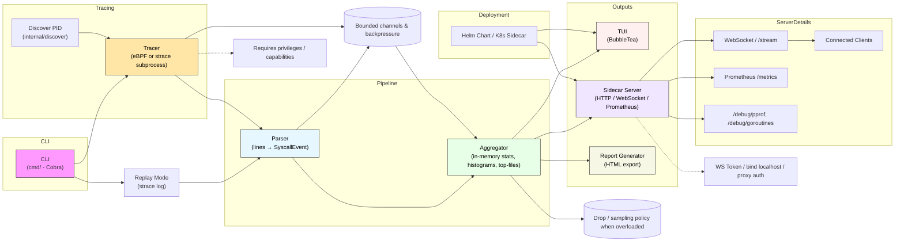

# stracectl Architecture Diagram (Mermaid)

This diagram maps the primary runtime components: tracer → parser → aggregator → outputs (TUI, Server, Report), plus CLI, replay, discovery, backpressure, deployment and security considerations.

File: ARCHITECTURE_DIAGRAM.md
