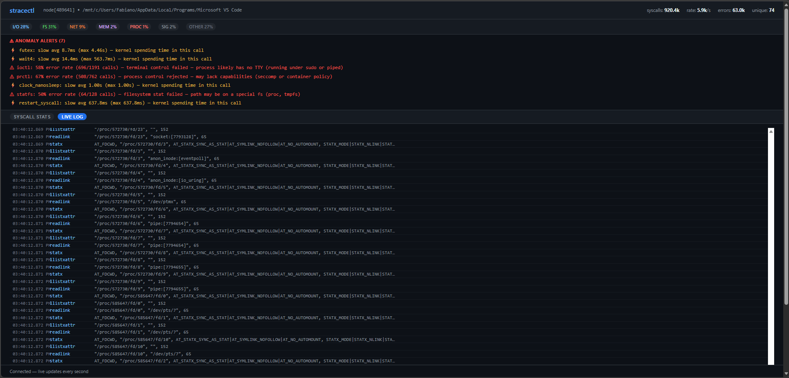

# Usage Guide

**Usage scenarios (examples):** see `docs/SCENARIOS.md` for step-by-step examples
and walkthroughs for each mode (`run`, `attach`, `stats`, `--serve`, `--backend ebpf`).

## Commands

### Global flags

These flags are available to all commands (place before the subcommand):

- `--ws-token <token>` — require a Bearer token for WebSocket connections when using `--serve`.
- `--debug` — enable verbose tracer diagnostics. When set, `stracectl` will emit
  raw strace lines useful for diagnosing parser edge cases (use only for troubleshooting).

### Trace a command from the start

```bash
sudo stracectl run curl https://example.com
sudo stracectl run -- python3 app.py --port 8080
```

Add `--report` to save a self-contained HTML file when the session ends:

```bash
sudo stracectl run --report report.html curl https://example.com
```

### Backend selection

Choose the tracing backend with `--backend` (available values: `auto`,
`ebpf`, `strace`). The default `auto` mode will pick the eBPF backend when the
running kernel supports the required features (Linux >= 5.8) and the binary was
built with eBPF support; otherwise it falls back to the classic `strace`
subprocess tracer. Use `--backend ebpf` to force the eBPF backend (requires an
eBPF-enabled build) or `--backend strace` to force the subprocess tracer.

Examples:

```bash
# auto (default)
sudo stracectl run --backend auto curl https://example.com

# force eBPF (requires eBPF-enabled binary and kernel support)
sudo stracectl run --backend ebpf --report trace-ebpf.html curl https://example.com

# force classic strace subprocess tracer
sudo stracectl run --backend strace curl https://example.com
```

### eBPF backend (brief)

The eBPF backend traces syscalls directly from the kernel using a small BPF
program and a ringbuffer for events. Advantages include lower overhead and
avoiding a `strace` subprocess. Requirements:

- Linux kernel >= 5.8 (BPF ringbuf support)
- Privileges to load eBPF programs (typically root or appropriate capabilities)
- An eBPF-enabled build of `stracectl` (see README and Docker targets)

To build an eBPF-enabled binary locally you need `clang`, linux headers, and
the `bpf2go` tool (from `github.com/cilium/ebpf/cmd/bpf2go`). The repository's
Dockerfile includes a `production-ebpf` target that builds an eBPF-capable
static binary.

For more details and troubleshooting see the dedicated documentation page in
the project site: `site/content/docs/ebpf.md`.

### Attach to a running process

```bash
sudo stracectl attach 1234
sudo stracectl attach "$(pgrep nginx | head -1)"
sudo stracectl attach --container myapp
```

Save a report on exit:

```bash
sudo stracectl attach --report nginx-report.html 1234
```

### Analyse a saved strace file (post-mortem)

If you already have a strace log captured with `-T`, you can analyse it offline:

```bash
# Capture with strace
strace -T -o trace.log curl https://example.com

# Analyse in TUI (no process needed)
stracectl stats trace.log

# Analyse and expose the same HTTP API
stracectl stats --serve :8080 trace.log

# Analyse and write an HTML report
stracectl stats --report report.html trace.log
```

### HTML report export

[](img/report.jpg)

`--report <path>` writes a self-contained HTML file — no server, no CDN, no `stracectl`
installation needed. It includes a summary bar, category breakdown, and a fully sortable
syscall table suitable for sharing, archiving, or attaching to an incident report.

### Per-file view (Top files)

`stracectl` can now surface the most-opened file paths observed during a trace.

- TUI: press `f` to open the Top Files overlay showing the most-opened paths
  and their counts (scroll with ↑/↓ or j/k).
- Sidecar API: `GET /api/files?limit=N` returns a JSON array of `{path,count}`.
- HTML report: include the top files table by passing `--report-top-files N` to
  `run`, `attach`, or `stats`.

This feature uses a cheap heuristic to extract pathname-like arguments from
`open`/`openat`/`creat` and to attribute fd-based syscalls when possible using
fd→path mappings. To avoid unbounded memory usage the aggregator caps the number
of distinct tracked paths and truncates overly long values; see
`docs/per_file_view.md` for design and tests.

### Sidecar / HTTP API mode

Pass `--serve <addr>` to any command to replace the TUI with an HTTP server:

```bash
# trace a command and expose results over HTTP
sudo stracectl run --serve :8080 curl https://example.com

# attach to PID 42 and stream metrics to Prometheus
sudo stracectl attach --serve :8080 42
```

Opening `http://localhost:8080` in any browser shows the **live web dashboard** — a
self-contained single-page app that connects to the server over WebSocket and updates
the table in real time, with no page reload needed:

### Segurança e uso local

Para troubleshooting pontual, prefira rodar o servidor ligado a `127.0.0.1` ou usar
`kubectl port-forward` para inspecionar um sidecar. Isso reduz muito a superfície de
ataque e evita a necessidade de regras de autenticação complexas durante a depuração.

- Bind em `127.0.0.1`: `sudo stracectl run --serve 127.0.0.1:8080 <comando>`.
- Port-forward (Kubernetes): `kubectl -n <ns> port-forward pod/<sidecar> 8080:8080`.
- Quando expor o serviço fora do host local, exija `--ws-token` e TLS; evite tokens em
  query string e prefira o header `Authorization: Bearer <token>`.
- Proteja `/metrics`: permita scrape apenas via rede interna ou com autenticação.

Essas práticas mantêm a experiência de troubleshooting leve enquanto reduzem riscos
quando o servidor precisa ficar disponível por mais tempo.

### Discover a container PID (Kubernetes sidecar)

When `shareProcessNamespace: true` is set on a Pod, all container processes are visible
from the sidecar. Use the `--container` flag to automatically attach to the right PID:

```bash
stracectl attach --serve :8080 --container myapp
```

You can also use the `discover` subcommand to script around the PID:

```bash
stracectl discover myapp
# prints the lowest PID whose cgroup path matches "myapp"
```

> **Permissions:** `strace` requires `CAP_SYS_PTRACE`.
> Run with `sudo`, or set `/proc/sys/kernel/yama/ptrace_scope` to `0` for your user.

---

## Dashboard screenshots

### TUI dashboard

[](img/dashboard.png)

### Live log

[](img/log.png)

### Detail overlay / web detail page

[](img/detail.png)

---

## HTTP API endpoints

Available when running with `--serve`:

| Endpoint | Description |
| -------- | ----------- |
| `GET /` | Live HTML dashboard with WebSocket-powered table, category pills, filter bar, and live log tab |
| `GET /syscall/{name}` | Per-syscall detail page: 9 live stat cards (incl. P95/P99), errno breakdown, recent errors, and reference panel |
| `GET /healthz` | Liveness probe — always returns `ok` |
| `GET /api/status` | JSON process metadata (PID, command, exe, cwd, elapsed, error rate, done flag) |
| `GET /api/stats` | JSON snapshot of all syscall stats, sorted by count |
| `GET /api/categories` | JSON breakdown by category |
| `GET /api/syscall/{name}` | JSON stats for a single syscall including P95/P99 and errno breakdown (404 if not yet seen) |
| `GET /api/log` | JSON array of the 500 most recent syscall events (name, return value, args, timestamp) |
| `WS /stream` | WebSocket push — fresh snapshot every second; closed server-side when the process exits |
| `GET /metrics` | Prometheus exposition format |

### Per-syscall detail page

Click any row in the web dashboard to open a dedicated detail page at `/syscall/<name>`
(e.g. `/syscall/openat`).

**Live stat cards** (updated every second via WebSocket):

| Card | Description |
| ---- | ----------- |
| Calls | Total number of times this syscall was called |
| Avg Latency | Mean kernel time per call (yellow when ≥ 5 ms) |
| P95 Latency | 95th-percentile kernel time (approximate, log₂ histogram) |
| P99 Latency | 99th-percentile kernel time |
| Min Latency | Lowest observed kernel time |
| Max Latency | Peak observed kernel time |
| Total Time | Cumulative kernel time across all calls |
| Errors | Absolute count of failed calls (red) |
| Error Rate | Percentage of calls that returned an error (red) |

**Errno breakdown** — bar chart of the most frequent errno codes (`ENOENT`, `EACCES`, `EAGAIN`, …).

**Recent error samples** — last 50 failed calls with timestamp, errno, and raw args.

**Syscall reference panel** — description, C signature, arguments, return value, and diagnostic notes.

---

## Keyboard shortcuts

| Key | Action |
| --- | ------ |
| `↑` / `k` | move cursor up |
| `↓` / `j` | move cursor down |
| `Enter` / `d` / `D` | open detail overlay for selected row |
| `c` | sort by CALLS (default) |
| `t` | sort by TOTAL time |
| `a` | sort by AVG latency |
| `x` | sort by MAX latency |
| `e` | sort by error count |
| `n` | sort alphabetically |
| `g` | sort by category |
| `/` | open filter prompt |
| `esc` | clear filter / reset cursor |
| `?` | open help overlay |
| `q` / `Ctrl+C` | quit |

---

## Reading the dashboard

### Header bar

```text
 stracectl  /usr/local/bin/homebrew-update  +1m22s     syscalls: 139.0k  rate: 16096/s  errors: 23.3k  unique: 90
```

| Field | Meaning |
| ----- | ------- |
| **target** | path or command being traced |
| **elapsed** | wall-clock time since tracing started |
| **syscalls** | total calls captured |
| **rate** | current syscalls/second — a sudden spike or drop is the first sign of anomaly |
| **errors** | absolute count of failed calls |
| **unique** | number of distinct syscall names — a low value on a busy process often means a tight loop |

### Category bar

```text
  I/O 35%    FS 28%    NET 18%    MEM 9%    PROC 7%    OTHER 3%
```

| Category | Syscalls included |
| -------- | ----------------- |
| I/O | `read`, `write`, `openat`, `close`, `pread64`, … |
| FS | `stat`, `fstat`, `access`, `lseek`, `getdents64`, … |
| NET | `socket`, `connect`, `sendto`, `recvfrom`, `epoll_wait`, … |
| MEM | `mmap`, `munmap`, `mprotect`, `madvise`, `brk`, … |
| PROC | `clone`, `execve`, `wait4`, `prctl`, `getpid`, … |
| SIG | `rt_sigaction`, `rt_sigprocmask`, `eventfd`, … |
| OTHER | everything not in the above categories |

### Table columns

| Column | Description |
| ------ | ----------- |
| `SYSCALL` | syscall name |
| `CAT` | category (I/O, FS, NET, MEM, PROC, SIG, OTHER) |
| `CALLS` | total number of times this syscall was called |
| `FREQ` | bar showing count relative to the most-called syscall |
| `AVG` | average kernel time per call (yellow when ≥ 5 ms) |
| `MAX` | peak latency — outliers that avg hides |
| `TOTAL` | cumulative kernel time |
| `ERRORS` | absolute number of failed calls (red when > 0) |
| `ERR%` | percentage of calls that returned an error (red when > 0) |

### Row colours

| Colour | Meaning |
| ------ | ------- |
| White/gray | normal |
| **Yellow** | AVG latency ≥ 5 ms — kernel spending significant time here |
| Orange | some errors, ERR% < 50% — often harmless |
| **Red bold** | ERR% ≥ 50% — more than half of all calls are failing |

### Anomaly alerts

When a row crosses a threshold, an alerts panel appears below the syscall table:

```text
──────────────────────────────────────────────────────────────────────────────
⚠  ioctl: 100% error rate (3/3 calls) — terminal control failed (no TTY)
⚠  connect: 45% error rate — Happy Eyeballs: IPv4/IPv6 tried in parallel, loser fails
⚡  wait4: slow avg 8.2ms (max 34ms) — kernel spending time in this call
──────────────────────────────────────────────────────────────────────────────
```

### Common patterns explained

| What you see | Why it happens | Is it a problem? |
| ------------ | -------------- | ---------------- |
| `openat` high ERR% | dynamic linker searches many paths before finding the `.so` | No |
| `recvfrom` high ERR% | `EAGAIN` on a non-blocking socket — no data ready yet | No |
| `connect` ~50% ERR% | Happy Eyeballs: IPv4 and IPv6 raced, loser is discarded | No |
| `ioctl` 100% ERR% | process has no TTY (running piped or under `sudo`) | No |
| `madvise` ERR% | kernel rejected memory hint — informational | No |
| `access` 100% ERR% | optional config file does not exist | Rarely |
| any syscall yellow | slow kernel path — I/O wait, lock contention, or disk | Investigate |
| any syscall red | repeated real failures | Yes |

### Detail overlay

Press `Enter` or `d` on any row to open a full-screen panel for that syscall.
Navigate with `↑`/`↓` or `j`/`k`; press any other key to close.

| Section | Contents |
| ------- | -------- |
| **SYSCALL REFERENCE** | name, category, plain-English description, C signature |
| **ARGUMENTS** | each parameter name and what it controls |
| **RETURN VALUE** | on-success value, common `errno` codes |
| **NOTES** | real-world patterns, caveats, and tips |
| **LIVE STATISTICS** | calls, errors, avg / max / min latency, total kernel time |
| **ANOMALY EXPLANATION** | appears when `ERR% ≥ 50%`; explains why the error is expected or alarming |

The knowledge base covers ~80 common Linux syscalls. Unknown syscalls receive a generic entry pointing to `man 2 <name>`.

### Help overlay

Press `?` at any time for a full in-app reference of every column, colour, category,
common pattern, and keyboard shortcut. Press any key to return.
