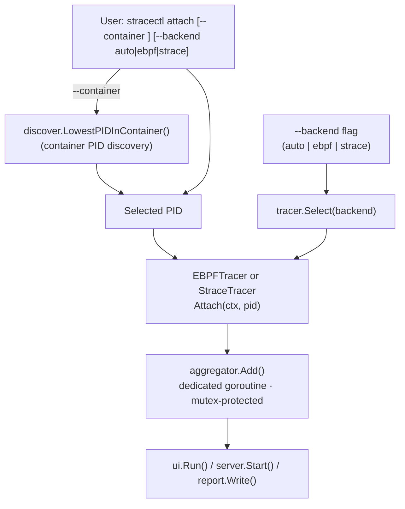

# Attach and container discovery

This diagram shows the attach workflow and container PID discovery: when `--container` is used, `discover.LowestPIDInContainer()` finds the target PID; `tracer.Select()` receives the `--backend` flag and selects the tracer (eBPF or strace), which then attaches to the PID and emits events into the aggregator.

