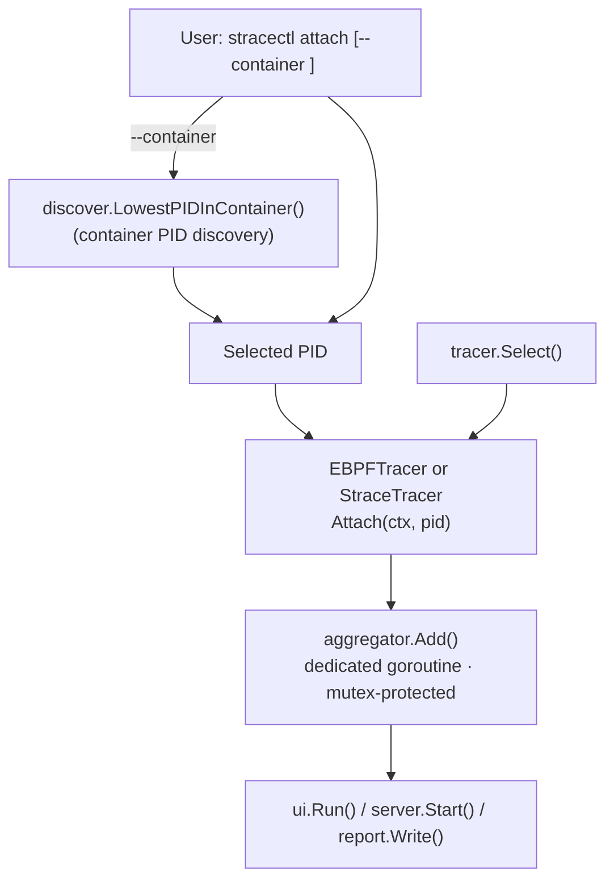

# Attach and container discovery

This diagram shows the attach workflow and container PID discovery: when `--container` is used, `discover.LowestPIDInContainer()` finds the target PID; the selected tracer (eBPF or strace) then attaches to the PID and emits events into the aggregator.

