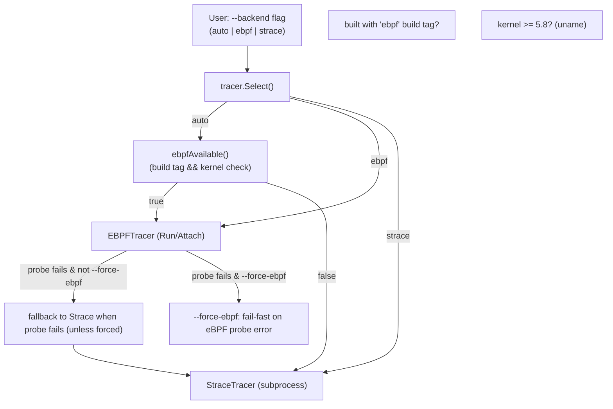

# Backend selection: eBPF vs Strace

This diagram describes how the tracing backend is selected. The `--backend` flag can force a backend; otherwise `tracer.Select()` uses runtime checks (build tag and kernel version) to choose eBPF when available, and falls back to the `strace` subprocess tracer. The `--force-ebpf` option causes a hard failure on eBPF probe errors.

