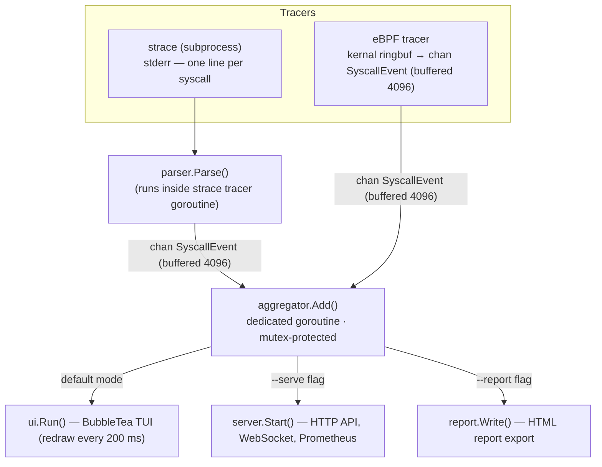

# Live tracing pipeline

This diagram shows the live tracing pipeline: events originate from either the eBPF tracer (kernel ringbuf → Go channel) or the `strace` subprocess (stderr lines parsed inline), are aggregated, and then consumed by the TUI, the HTTP sidecar, or exported as an HTML report.

