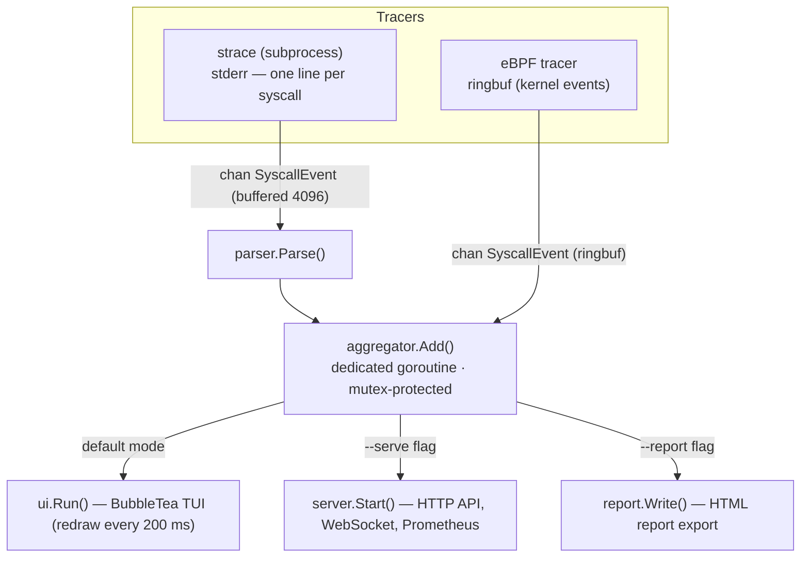

# Live tracing pipeline

This diagram shows the live tracing pipeline: events originate from either the eBPF tracer (kernel ringbuf) or the `strace` subprocess, are parsed, aggregated, and then consumed by the TUI, the HTTP sidecar, or exported as an HTML report.

