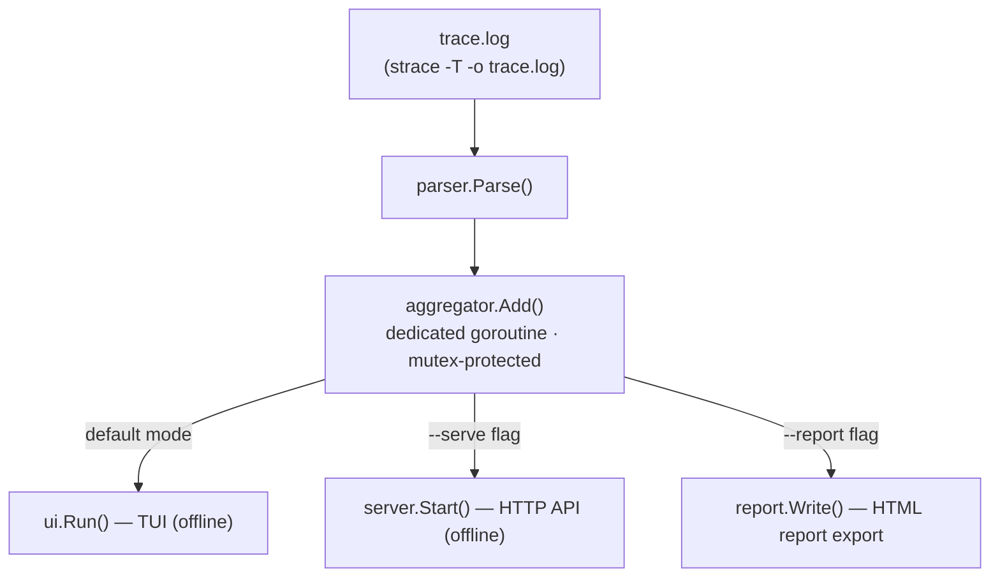

# Post-mortem / Replay flow

This diagram shows the post-mortem analysis flow: a `strace -T -o` file is parsed and fed into the same aggregation pipeline used by live tracing, enabling the TUI, the HTTP sidecar, and HTML report export on offline data.

