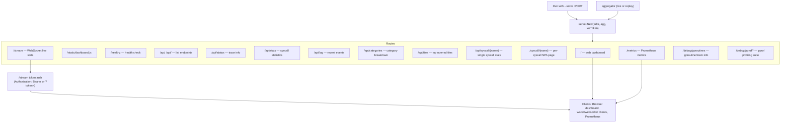

# Sidecar / Server mode

This diagram documents the sidecar (HTTP) mode: the server exposes the web dashboard, the `/stream` WebSocket (optional token authentication), JSON API endpoints, Prometheus metrics, and debug/pprof endpoints. Clients include browsers (dashboard), WebSocket clients, and Prometheus scrapers.

