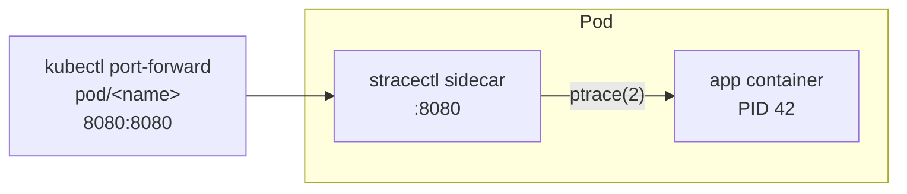

## Overview

`stracectl` ships with:

- A minimal **Dockerfile** based on `debian:bookworm-slim`
- **Raw Kubernetes manifests** under `deploy/k8s/`
- A **Helm chart** under `deploy/helm/stracectl/`

The sidecar pattern works by sharing the **PID namespace** of the Pod. With
`shareProcessNamespace: true`, the `stracectl` container can see every process
inside the Pod — including those belonging to your app container — and use
`ptrace(2)` to intercept their syscalls. No shell access, no code changes, no
restarts required.

## How it works



`ptrace` in attach mode is **non-intrusive**: it observes syscall entry/exit
without modifying the target process's execution.

## Prerequisites

Three settings are **required** on the sidecar container:

| Setting | Value | Why |
| --------- | ------- | ----- |
| `spec.shareProcessNamespace` | `true` | Without this each container has its own PID namespace; the sidecar cannot see the app's processes |
| `capabilities.add` | `[SYS_PTRACE]` | The Linux capability that allows `strace` to call `ptrace(2)` on another process |
| `seccompProfile.type` | `Unconfined` | The default Kubernetes seccomp profile blocks the `ptrace` syscall; it must be disabled on the sidecar |

> `runAsUser: 0` is also required because the `strace` binary needs root to
> attach to processes owned by other UIDs.

## Quick start with raw manifests

```bash
kubectl apply -f deploy/k8s/sidecar-pod.yaml
```

The manifest (`deploy/k8s/sidecar-pod.yaml`) creates a Pod with two containers:
the app placeholder and the hardened `stracectl` sidecar. Replace `myapp:latest`
with your real image.

## Step-by-step guide

**1. Apply the manifest or Helm chart** (see below).

**2. Discover the app's PID** — the YAML uses `"1"` as a placeholder. Find the
real PID by running `stracectl discover` inside the sidecar:

```bash
kubectl exec <pod-name> -c stracectl -- stracectl discover myapp
# → 42
```

`discover` scans `/proc` for processes whose cgroup path contains the given
name, handling namespace boundaries automatically.

**3. Attach and serve** — the manifest already passes `--serve :8080` so the
sidecar starts the HTTP API automatically. To run it manually:

```bash
kubectl exec <pod-name> -c stracectl -- \
  stracectl attach --serve :8080 "$(stracectl discover myapp)"
```

**4. Forward the port and explore:**

```bash
kubectl port-forward pod/<pod-name> 8080:8080
```

| What | Command |
| ------ | --------- |
| Live web dashboard | `open http://localhost:8080` |
| All syscalls (JSON) | `curl localhost:8080/api/syscalls \| jq .` |
| One syscall detail (P95/P99, errno) | `curl localhost:8080/api/syscall/read \| jq .` |
| Process metadata + global stats | `curl localhost:8080/api/status \| jq .` |
| Last 500 raw events (JSON) | `curl localhost:8080/api/log \| jq .` |
| WebSocket live stream | `wscat -c ws://localhost:8080/ws` |
| Prometheus metrics | `curl localhost:8080/metrics` |

## Annotated sidecar spec

```yaml
spec:
  # Required: all containers in the Pod share one PID namespace.
  shareProcessNamespace: true

  containers:
  - name: app
    image: myapp:latest          # replace with your workload

  - name: stracectl
    image: fabianoflorentino/stracectl:v1.0.23
    args:
      - attach
      - --serve
      - ":8080"
      - "1"            # placeholder — use `stracectl discover <name>` for the real PID
    ports:
      - name: http
        containerPort: 8080
    securityContext:
      runAsUser: 0               # strace must run as root to attach to other-UID processes
      runAsNonRoot: false
      privileged: false          # privileged is NOT required — only SYS_PTRACE is needed
      allowPrivilegeEscalation: false
      readOnlyRootFilesystem: true
      seccompProfile:
        type: Unconfined         # default seccomp blocks ptrace(2); unconfined only on the sidecar
      capabilities:
        drop: [ALL]              # drop everything first
        add:  [SYS_PTRACE]      # then add only what is needed
    resources:
      requests: { cpu: "50m",  memory: "32Mi" }
      limits:   { cpu: "200m", memory: "64Mi" }
```

## Helm chart

```bash
helm install stracectl ./deploy/helm/stracectl \
  --set target.image=your-app:latest \
  --set serve.port=8080
```

Key values (`values.yaml`):

| Value | Default | Description |
| ------- | --------- | ------------- |
| `target.image` | — | Image of the workload container |
| `serve.port` | `8080` | Port for the HTTP / WebSocket API |
| `serve.enabled` | `true` | Enable HTTP sidecar mode |
| `resources.limits.memory` | `128Mi` | Memory limit for the sidecar |
| `serviceMonitor.enabled` | `false` | Create a Prometheus ServiceMonitor |

## HTTP API endpoints

| Endpoint | Method | Description |
| ---------- | -------- | ------------- |
| `/` | GET | Live HTML dashboard |
| `/api/syscalls` | GET | JSON snapshot of all aggregated syscalls |
| `/api/syscall/{name}` | GET | JSON detail for one syscall (P95/P99, errno breakdown, recent error samples) |
| `/api/status` | GET | Process metadata + global stats |
| `/api/log` | GET | Most recent 500 raw syscall events |
| `/ws` | WS | WebSocket live feed (`SyscallEvent` JSON) |
| `/metrics` | GET | Prometheus metrics |

## Prometheus + Grafana

Enable the `ServiceMonitor`:

```bash
helm upgrade stracectl ./deploy/helm/stracectl \
  --set serviceMonitor.enabled=true \
  --set serviceMonitor.namespace=monitoring
```

This creates a `ServiceMonitor` CRD that Prometheus Operator will scrape
automatically. Import the provided Grafana dashboard JSON for a
pre-built syscall breakdown view.

## Security considerations

- `seccompProfile: Unconfined` applies **only** to the `stracectl` sidecar container, not to the app.
- `privileged: false` — the sidecar does **not** need full privileged mode, only `SYS_PTRACE`.
- **Pod Security Standards**: namespaces at the `restricted` level will block this pod.
  Use `baseline` or `privileged` PSS for the namespace (or bind the exception to the workload's
  `ServiceAccount`) when deploying observability tooling.
- `ptrace` in attach mode is non-intrusive: it observes syscall entry/exit without altering
  the target process's behaviour or memory.
